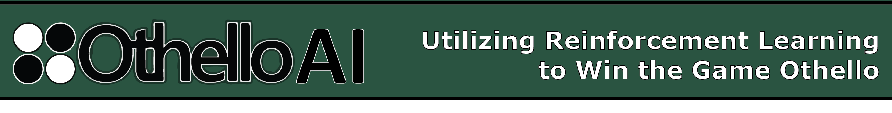

OthelloAI: Utilizing Reinforcement Learning to Win the Game Othello
Megan Ku and Colin Snow
Machine Learning Final Project Fall 2019

What is Reinforcement Learning (RL)?
Reinforcement learning is a type of machine learning that focuses on the ability to make a sequence of decisions based on observations in a given environment. Unlike other forms of machine learning which are trained on pre-existing data, RL algorithms are able to navigate a problem space by evaluating potential actions. As a result, RL has a distinct advantage when playing games as the model is able to choose where to search for new opportunities instead of sampling randomly within a problem space.

The overall flow of information in a reinforcement learning model, as can be seen in Figure 1, is a feedback loop between the “Agent” and the “Environment” that the “Agent” exists in. Based on observations of the environment, the agent will make a decision on actions to make, which will update the environment’s state. The new environment will be observed, along with a reward that quantifies whether that action was favorable.  In the context of the board game Othello, the “Agent” is the player, the “Environment” is the current board state, the action is the move the player makes on their turn, and the reward corresponds to whether that move brings the player closer to winning.  
A notable achievement of reinforcement learning is the success of Alpha Go Zero, an AI developed by Google’s DeepMind team [4].  For years, the game of Go was considered to be beyond the complexity of computer programs, with “more possible configurations for pieces than atoms in the universe”[6]. This reinforcement learning model was trained entirely on self-play, meaning that all data generated by exploration was generated without the influence or bias of human strategies or tendencies. Alpha Go Zero has three predecessors, Alpha Go Fan,  Alpha Go Lee, and Alpha Go Master which were trained on a combination of self-play and data from human-played games. Within days of training, though, Alpha Go Zero was able to surpass those previous models, and DeepMind declared it the best Go player of all time.  In recent news, Lee Sedol, the namesake for Alpha Go Lee, declared that he is retiring from Go competition, stating that “Even if I become the number one, there is an entity that cannot be defeated”[6]. 

The applications of reinforcement learning expand to other games, like Hide and Seek, and to real-world motor skills, like walking. Reinforcement learning is also most similar to how humans learn through observation and action in the physical environment.

One of the major drawbacks of RL is the amount of time it takes to train a model. Since the model needs to explore the problem space, the environment often needs to be run thousands of times. While a classic convolutional neural network will take minutes to run, successful RL algorithms take days to train. For example, the Alpha Go Zero model generated about 4.9 million games over three days on a single machine in the Google Cloud with 4 TPUs [4]. For the scope of our project, we knew that trying to achieve a superhuman player would be out of scope given our limited computing resources and time. Because of this, we wanted to see how much, if any, Othello game strategy our model could learn.

Model

The key goal of our project was to create a program that could play Othello without any previous knowledge of the rules, mechanics, or strategies that are fundamental to the way humans play the game. We wanted to observe how well our algorithm could adapt given these limitations and compare performance levels to that of human players. We pushed this naive model to the extreme by only feeding it with the current board state and asking it to choose a move without providing the context of previous or future moves. This lack of information naturally prevents the algorithm from discovering all of the possible strategies in the game, but despite this, it is able to grow to learn many of the subtleties of the game that experienced players often use.

Our program learns by playing another pre-existing algorithm that uses a deep Monte Carlo game tree as well as several human-coded strategies to select moves. This means that the training algorithm has access to much more information than our model, and serves as a proxy for a very experienced opponent.

By playing games against this algorithm, our program builds up a large repertoire of example moves made and whether or not they lead to winning the game. This structure allows our model to learn how to choose moves that maximize winning opportunities.

Key Aspects and Inspirations

Monte Carlo Backpropagation

RL algorithms learn by maximizing a reward that is set by the model, searching and performing actions that produce favorable outcomes. In cases where the reward is based on winning, many actions must be carried out before the reward is received. Monte Carlo backpropagation is a method of assigning rewards to those intermediate actions based on whether or not they lead to a desirable end state.

Probabilistic Selection

A common problem in RL occurs when the model repeatedly follows the same path without fully exploring the problem space. This usually occurs because the network itself is deterministic, meaning that it will return the same output for any input. In order to encourage movement away from known paths, we evaluate the expected reward for every possible move and choose probabilistically from these values to make the next move. This makes the network better at exploring the entire game space instead of locking onto one winning path.

Results

After 200 games against the existing algorithm, our model increased its score by 2.5 points per game and was able to beat the existing model about 30% of the time. This success rate correlates to the skill of a relatively experienced player, but it is certainly no match against an expert. Based on these results, we can conclude that a totally naive model such as this can learn to play the game and make strategic decisions based on relatively little information, but that it is limited in skill by both the amount of training data that can be reasonably acquired without vast computational resources and by the amount of information that can be encoded into only the current board state.

Using the Model

Setup

Clone the repo and run the following programs listed below.

Training

Run model_simple_gpu.py in Model/playComputer

The model can be trained on any computer, however the process will be extremely slow without GPU acceleration. We used Google Colab with GPU for training and then exported our model to be played by human players. The training algorithm is dependent on the crunner.py and compiledothello.c programs being in its home directory, so if Colab is used these need to be uploaded as well.

Human Play

Run playagainsthuman.py in Model/PlayHuman

Once a model is trained, it can be used to play the command-line version of the game. The game is dependent on compilednomovecomputer.c, compilednomoveplayer.c, and playhuman.py being in its home directory.

References

[1] “5 Things You Need to Know about Reinforcement Learning.” KDnuggets, 2019, www.kdnuggets.com/2018/03/5-things-reinforcement-learning.html.

[2] Horton, Ivor. Beginning C. Apress, 2004.

[3] “Reinforcement Learning (DQN) Tutorial.” Reinforcement Learning (DQN) Tutorial - PyTorch Tutorials 1.3.1 Documentation, PyTorch, 2017, pytorch.org/tutorials/intermediate/reinforcement_q_learning.html.

[4] Silver, David, et al. “Mastering the Game of Go without Human Knowledge.” Nature, vol. 550, no. 7676, 2017, pp. 354–359., doi:10.1038/nature24270.

[5] Sutton, Richard S., and Andrew G. Barto. Reinforcement Learning: An Introduction. The MIT Press, 2018.

[6] Vincent, James. “Former Go Champion Beaten by DeepMind Retires after Declaring AI Invincible.” The Verge, The Verge, 27 Nov. 2019, www.theverge.com/2019/11/27/20985260/ai-go-alphago-lee-se-dol-retired-deepmind-defeat.
